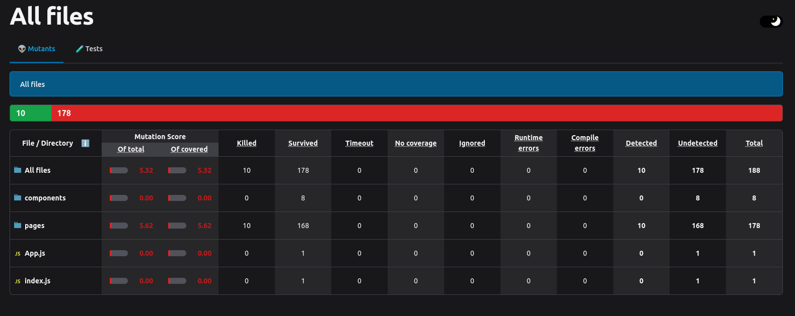

# Alumni Registration Portal

This project is a web-based **Alumni Registration Portal** developed to facilitate the management and registration of alumni. It provides functionalities for user login, searching alumni, and managing contact, education, and experience details.

## Features
- **Login System**: Allows users to log in securely.
- **Search Alumni**: Search functionality to find alumni using various filters.
- **Forms**: Dynamic forms for entering and managing:
  - Contact Information
  - Educational Background
  - Professional Experience

## Technology Stack
- **Frontend**: React.js
- **Backend**: Spring Boot
- **Database**: MySQL

## Testing
- **Unit Testing**: Unit test cases were designed and implemented for each component.
- **Mutation Testing**: Integrated **Stryker** to perform mutation testing and assess the robustness of the code. 
  - **Mutation Score**: See the screenshot below for the mutation testing score using Stryker.



## Roles and Contributions
1. **Keshav Agarwal (Roll Number: MT2023114)**
   - Developed the **backend and frontend** for:
     - Login Page
     - Search Page

2. **Pratyasa Ray (Roll Number: MT2023014)**
   - Developed the **backend and frontend** for:
     - Forms for Contact, Education, and Experience.

## How to Run the Project
1. **Clone the repository**:
   ```bash
   git clone https://github.com/your-repo-link.git
   cd alumni-registration-portal
   ```

2. **Backend Setup**:
   - Ensure you have Java and Maven installed.
   - Navigate to the backend folder:
     ```bash
     cd backend
     mvn clean install
     mvn spring-boot:run
     ```

3. **Frontend Setup**:
   - Ensure you have Node.js and npm installed.
   - Navigate to the frontend folder:
     ```bash
     cd frontend
     npm install
     npm start
     ```

4. **Database Setup**:
   - Create a MySQL database named `alumni_portal`.
   - Import the provided SQL schema from `db/schema.sql`.

5. Access the portal:
   - Frontend: `http://localhost:3000`
   - Backend API: `http://localhost:8080`


## License
This project is licensed under the MIT License. See the LICENSE file for details.

## Acknowledgments
- **IIIT Bangalore**: For academic support and resources.
- **Stryker**: For the mutation testing framework.

---
